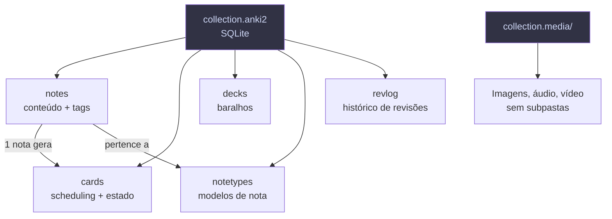

# Anki Toolkit

Ferramentas para analisar, limpar e gerar decks Anki programaticamente. Inclui integração com NotebookLM para converter flashcards em massa.

## Estrutura

```
anki/
├── scripts/                         # Ferramentas Python
│   ├── analisar_colecao.py          # Relatório completo da coleção
│   ├── limpar_colecao.py            # Remove note types/decks sem uso
│   ├── importar_csv.py              # Gera CSVs prontos para importação
│   ├── comparar_decks.py            # Qualidade + sobreposições entre decks
│   ├── notebooklm_to_anki.py        # Converter 1 notebook NLM → .apkg
│   ├── batch_nlm_download.py        # Baixar flashcards de N notebooks
│   └── batch_por_categoria.py       # Organizar por categoria temática
├── gerar_deck.py                    # Deck Dev (142 cards, programação)
├── gerar_deck_meta.py               # Deck Meta (34 cards, sobre o Anki)
├── docs/                            # Documentação
│   ├── SUMMARY.md                   # Índice da doc oficial do Anki (56 págs)
│   ├── guia-manipulacao-arquivos-anki.md
│   └── aprendizados.md              # Tudo que aprendemos consolidado
├── output/                          # .apkg gerados (por categoria)
│   ├── NLM-Programação.apkg         # 38 decks, 2075 cards
│   ├── NLM-Medicina.apkg            # 29 decks, 1916 cards
│   ├── NLM-Data.apkg                # 14 decks, 663 cards
│   ├── NLM-Ferramentas.apkg         # 4 decks, 244 cards
│   ├── NLM-Gestão.apkg              # 1 deck, 143 cards
│   ├── NLM-Finanças.apkg            # 1 deck, 50 cards
│   └── NLM-Outros.apkg              # 4 decks, 258 cards
├── dados/                           # JSONs exportados (não versionados)
├── backups/                         # Backups automáticos (não versionados)
├── preview_cards.html               # Preview visual dos cards no browser
├── Dev_Programacao.apkg             # Deck de programação (142 cards)
└── Meta_Anki_Flashcards.apkg        # Deck sobre o Anki (34 cards)
```

## Uso Rápido

```bash
# Analisar coleção (Anki deve estar fechado)
python3 scripts/analisar_colecao.py --perfil Data --exportar

# Simular limpeza (ver o que seria removido)
python3 scripts/limpar_colecao.py --dry-run

# Limpar de verdade (faz backup automático)
python3 scripts/limpar_colecao.py --auto

# Análise de qualidade dos cards
python3 scripts/comparar_decks.py

# Gerar CSVs de exemplo para importação
python3 scripts/importar_csv.py

# Gerar decks .apkg
python3 gerar_deck.py
python3 gerar_deck_meta.py
```

### Integração NotebookLM → Anki

```bash
# Converter 1 notebook
python3 scripts/notebooklm_to_anki.py dados/flashcards.json --deck "NLM::Git"

# Baixar + converter de um notebook
python3 scripts/notebooklm_to_anki.py --download --notebook <id>

# Batch: baixar todos os notebooks com flashcards
python3 scripts/batch_nlm_download.py

# Organizar por categoria (Programação, Medicina, Data, etc.)
python3 scripts/batch_por_categoria.py
```

## Como o Anki armazena dados



## Dependências

```bash
pip install genanki         # gerar .apkg
pip install notebooklm-py   # integração NotebookLM (opcional)
# sqlite3 e csv são built-in do Python
```
