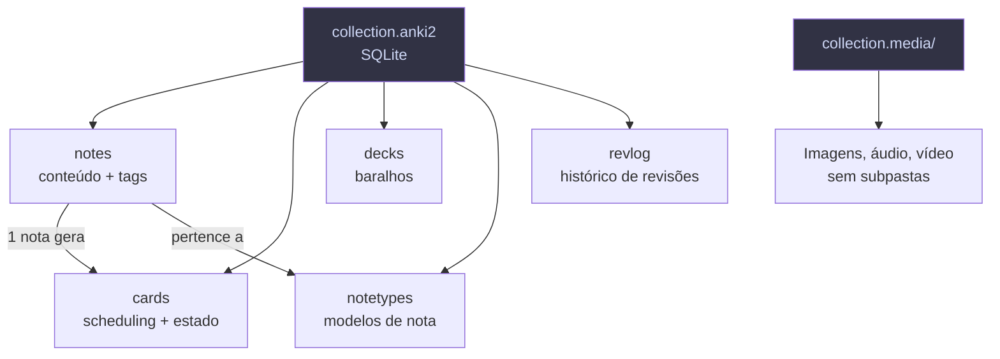

# Anki Toolkit

Ferramentas para analisar, limpar e gerar decks Anki programaticamente.

## Estrutura

```
anki/
├── scripts/                    # Ferramentas Python
│   ├── analisar_colecao.py     # Relatório completo da coleção
│   ├── limpar_colecao.py       # Remove note types/decks sem uso
│   └── importar_csv.py         # Gera CSVs prontos para importação
├── gerar_deck.py               # Gerador de .apkg (deck compilado)
├── docs/                       # Documentação do Anki (56 páginas .md)
│   ├── SUMMARY.md              # Índice
│   └── guia-manipulacao-arquivos-anki.md
├── output/                     # CSVs gerados para importação
├── dados/                      # JSONs exportados (análise)
├── backups/                    # Backups automáticos (não versionados)
└── Dev_Programacao.apkg        # Deck de programação (142 cards)
```

## Uso Rápido

```bash
# Analisar coleção (Anki deve estar fechado)
python3 scripts/analisar_colecao.py --perfil Data --exportar

# Simular limpeza (ver o que seria removido)
python3 scripts/limpar_colecao.py --dry-run

# Limpar de verdade (faz backup automático)
python3 scripts/limpar_colecao.py --auto

# Gerar CSVs de exemplo para importação
python3 scripts/importar_csv.py

# Gerar deck .apkg de programação
python3 gerar_deck.py
```

## Como o Anki armazena dados



## Dependências

```bash
pip install genanki  # apenas para gerar .apkg
# sqlite3 e csv são built-in do Python
```
