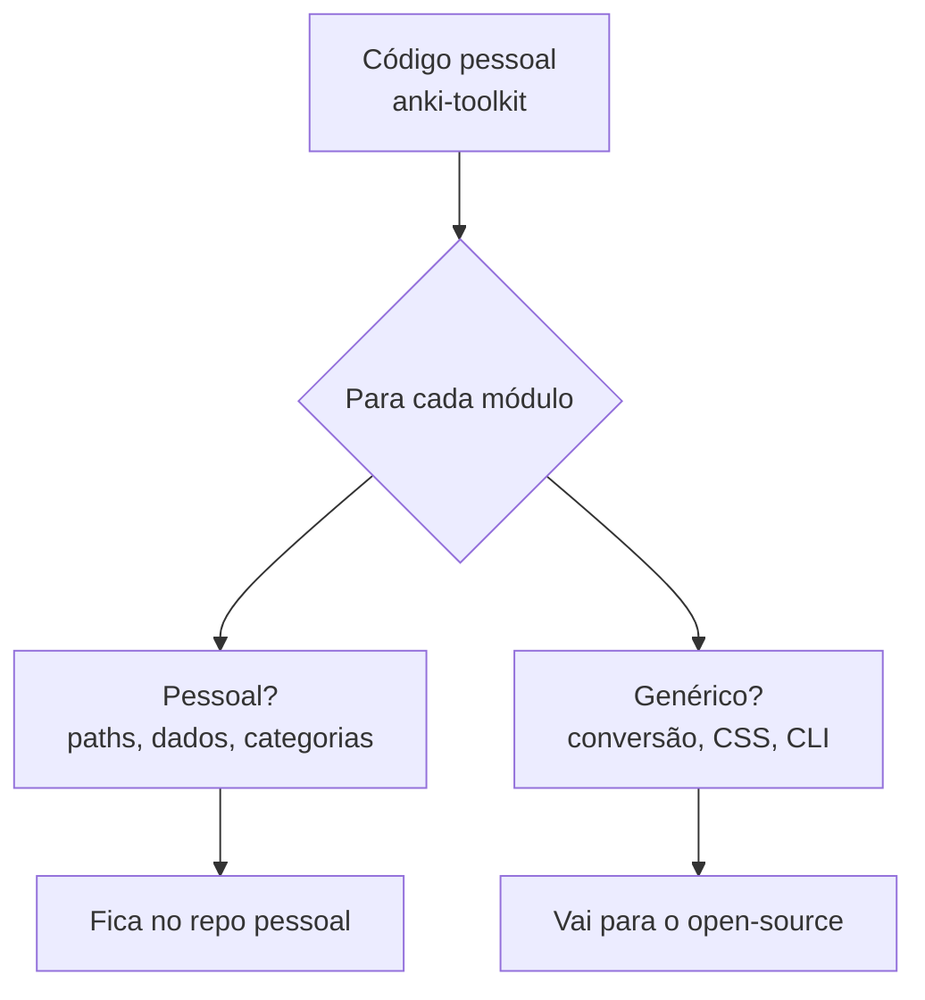

# Do Código Pessoal ao Open Source — Guia Prático

> [!info] Este documento registra o processo completo que usamos para transformar scripts pessoais do Anki Toolkit em um pacote Python open-source publicável no PyPI.

## 1. A Mentalidade

### Quando vale a pena tornar open-source?

Pergunte-se:

1. **Resolve um problema real?** → "Converter flashcards do NotebookLM para Anki" resolve algo que milhares de estudantes querem
2. **Não existe solução?** → Não existia ferramenta que fizesse NLM → Anki
3. **O código funciona para você?** → Sim, testado com 91 notebooks, 6000+ cards
4. **Outras pessoas teriam o mesmo caso de uso?** → Qualquer estudante que usa NLM + Anki

Se as 4 respostas forem sim → vale a pena.

### O que NÃO tornar open-source

- Código que só funciona com seus dados específicos
- Scripts com credenciais ou dados pessoais embutidos
- Soluções muito nichadas (ex: "organizar MEUS decks de medicina")

## 2. O Processo Passo a Passo

### Fase 1: Identificar o que é genérico



No nosso caso:

| Pessoal (ficou em anki-toolkit) | Genérico (foi para notebooklm-to-anki) |
|---------------------------------|---------------------------------------|
| analisar_colecao.py | converter.py (flashcards) |
| limpar_colecao.py | quiz_converter.py (quizzes) |
| comparar_decks.py | themes.py (3 temas CSS) |
| gerar_deck.py (meus cards) | enricher.py (formatação HTML) |
| CATEGORIAS hardcoded | categorizer.py (configurável via YAML) |
| Meus JSONs e backups | nlm_client.py (wrapper do notebooklm-py) |
| Docs do Anki (56 páginas) | cli.py (entry point) |

### Fase 2: Extrair e generalizar

Regras que seguimos:

1. **Sem paths hardcoded** — `Path(__file__).parent` em vez de `/Users/diogenes/...`
2. **Sem dados pessoais** — categorias viram arquivo YAML editável
3. **Sem português no código** — docstrings em inglês (mensagens ao usuário podem ser inglês)
4. **Dependências mínimas** — só `genanki` como obrigatória, `notebooklm-py` como opcional
5. **Testes** — fixtures com dados de exemplo, não dados reais
6. **Config por convenção** — funciona sem config (cada notebook = 1 deck), config YAML é opt-in

### Fase 3: Empacotar como projeto Python

Estrutura de um pacote Python publicável:

```
notebooklm-to-anki/
├── src/nlm2anki/          # Código fonte
│   ├── __init__.py        # version + exports
│   ├── cli.py             # Entry point (argparse)
│   └── ...módulos...
├── tests/                 # Testes pytest
│   ├── fixtures/          # JSONs de exemplo
│   └── test_converter.py
├── pyproject.toml         # ⭐ Configuração do pacote (substitui setup.py)
├── README.md              # Em inglês para open-source
├── LICENSE                # MIT (permissiva)
├── .gitignore
└── categories.example.yaml
```

> [!tip] `pyproject.toml` é o padrão moderno do Python (substituiu setup.py + setup.cfg). Nele você define nome, versão, dependências, entry points, e build system.

### Fase 4: pyproject.toml — o coração do pacote

```toml
[build-system]
requires = ["hatchling"]
build-backend = "hatchling.build"

[project]
name = "notebooklm-to-anki"         # nome no PyPI
version = "0.1.0"                    # semver
dependencies = ["genanki>=0.13"]     # obrigatórias

[project.optional-dependencies]
nlm = ["notebooklm-py>=0.3"]        # pip install notebooklm-to-anki[nlm]
dev = ["pytest>=7.0"]                # pip install notebooklm-to-anki[dev]

[project.scripts]
nlm2anki = "nlm2anki.cli:main"      # cria o comando `nlm2anki`
```

O que cada seção faz:
- **build-system**: qual ferramenta constrói o pacote (hatchling é moderna e simples)
- **project**: metadados (nome, versão, autor, descrição)
- **dependencies**: o que é instalado junto automaticamente
- **optional-dependencies**: extras opcionais (instala com `pip install nome[extra]`)
- **scripts**: cria comandos CLI (nlm2anki → chama nlm2anki.cli:main())

### Fase 5: Publicar no PyPI

```bash
# 1. Criar conta em pypi.org
# 2. Gerar API token em pypi.org/manage/account/token/

# 3. Instalar ferramentas
pip install build twine

# 4. Construir o pacote
python -m build
# Gera dist/notebooklm_to_anki-0.1.0.tar.gz
#     + dist/notebooklm_to_anki-0.1.0-py3-none-any.whl

# 5. Publicar
twine upload dist/*
# Pede usuário: __token__
# Pede senha: pypi-AgEI... (seu token)

# 6. Pronto! Qualquer pessoa pode instalar:
pip install notebooklm-to-anki
```

> [!warning] O nome no PyPI é **global e único**. Uma vez publicado como `notebooklm-to-anki`, ninguém mais pode usar esse nome. Verifique antes em pypi.org/project/notebooklm-to-anki/

## 3. Decisões de Design que Tomamos

### Por que dependência opcional?

```toml
[project.optional-dependencies]
nlm = ["notebooklm-py>=0.3"]
```

O `notebooklm-py` é uma lib não-oficial que faz web scraping. Pode quebrar se o Google mudar a interface. Tornando opcional:
- Quem só quer converter JSONs locais: `pip install notebooklm-to-anki`
- Quem quer integração direta: `pip install notebooklm-to-anki[nlm]`

Se o notebooklm-py quebrar, o core da ferramenta continua funcionando.

### Por que 3 temas e não CSS customizável?

Para estudantes (público B), "escolha dark, light ou minimal" é mais acessível que "escreva seu CSS". Três opções cobrem 90% dos casos sem complexidade.

### Por que YAML para categorias e não auto-categorização por IA?

- IA é opinativa — pode errar a categoria
- YAML é transparente — o usuário vê e edita
- Sem IA = sem dependência extra, sem custo de API
- Default = sem categorização (cada notebook = 1 deck) — zero config

### Por que auto-detectar formato do JSON?

```python
if "cards" in data:
    # É flashcard
elif "questions" in data:
    # É quiz
```

O usuário não precisa saber se o arquivo é flashcard ou quiz. `nlm2anki convert arquivo.json` funciona para ambos.

## 4. Checklist para Futuras Open-Sourcificações

Use este checklist quando quiser transformar outro projeto pessoal em open-source:

- [ ] O código resolve um problema que outros têm?
- [ ] Removi todos os paths hardcoded?
- [ ] Removi dados pessoais, credenciais, tokens?
- [ ] Configuração é por arquivo (YAML/JSON), não hardcoded?
- [ ] Funciona sem configuração (defaults sensatos)?
- [ ] README em inglês com Quick Start em 3 linhas
- [ ] LICENSE presente (MIT para máxima adoção)
- [ ] pyproject.toml com metadados completos
- [ ] Testes com fixtures de exemplo (não dados reais)
- [ ] .gitignore exclui __pycache__, .venv, dist/
- [ ] Entry point CLI definido em [project.scripts]
- [ ] Dependências mínimas (opcional para extras)
- [ ] Funciona em mais de um OS (ou documenta limitação)

## 5. Flashcards — Conceitos-Chave

| Pergunta | Resposta |
|----------|----------|
| O que é o PyPI? | Python Package Index — o "app store" do Python. `pip install` baixa daqui |
| O que é pyproject.toml? | Arquivo de config do pacote Python moderno (substitui setup.py) |
| O que faz `[project.scripts]`? | Cria comandos CLI. `nlm2anki = "nlm2anki.cli:main"` → comando `nlm2anki` |
| O que são optional dependencies? | Extras instalados com `pip install nome[extra]` — não obrigatórios |
| O que é `hatchling`? | Build backend moderno para pacotes Python |
| O que faz `python -m build`? | Gera .tar.gz e .whl na pasta dist/ para upload ao PyPI |
| O que faz `twine upload`? | Publica o pacote no PyPI |
| O que é semver? | Versionamento semântico: MAJOR.MINOR.PATCH (ex: 0.1.0) |
| Quando usar MIT License? | Quando quer máxima adoção — permite uso comercial, modificação, redistribuição |
| O que é entry point? | Ponto de entrada que o pip usa para criar o comando CLI executável |
