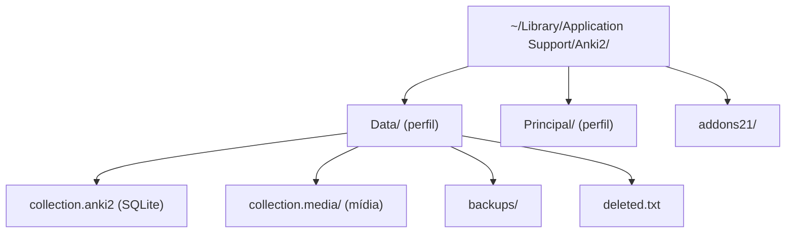
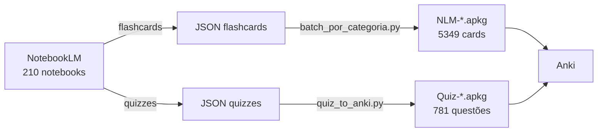
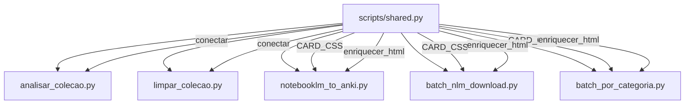

# Aprendizados — Anki Toolkit

> [!info] Documento consolidado de tudo que aprendemos sobre manipulação do Anki, design de flashcards, e automação com NotebookLM.

## 1. Como o Anki Armazena Dados

### Estrutura de arquivos



> [!warning] Sempre verificar qual perfil está ativo antes de modificar. O nome aparece na barra de título do Anki ("Data - Anki").

### Banco SQLite (`collection.anki2`)

| Tabela | Conteúdo |
|--------|----------|
| `notes` | Conteúdo (campos separados por `\x1f`, tags) |
| `cards` | Instâncias de estudo (type, interval, ease, lapses) |
| `decks` | Baralhos (hierarquia com `::`) |
| `notetypes` | Modelos de nota (Basic, Cloze, etc.) |
| `revlog` | Log de todas as revisões (timestamp como ID) |

### Estados de um card (`cards.type`)

| Valor | Estado | Significado |
|-------|--------|-------------|
| 0 | New | Nunca estudado |
| 1 | Learning | Em aprendizado (intervalos curtos) |
| 2 | Review | Aprendido, em revisão espaçada |
| 3 | Relearning | Errou e voltou para aprendizado |

### Collation `unicase`

O Anki registra uma collation customizada no SQLite. O `sqlite3` CLI não a conhece — queries com ORDER BY em texto falham.

```python
# Solução: registrar collation equivalente
conn.create_collation('unicase',
    lambda a, b: (a.lower() > b.lower()) - (a.lower() < b.lower()))
```

### Separador de campos

Campos são concatenados com `\x1f` (ASCII 31, "unit separator"):

```python
campos = nota.flds.split('\x1f')
# campos[0] = Frente, campos[1] = Verso, etc.
```

## 2. Formatos de Arquivo

### `.apkg` — Deck Empacotado

- É um **ZIP** contendo SQLite + mapa de mídia JSON
- Na importação: **mescla** com a coleção (não substitui)
- Notas existentes são atualizadas pelo GUID
- Descompactar: `unzip deck.apkg -d conteudo/`

### `.colpkg` — Coleção Completa

- Também ZIP + SQLite + mídia
- Na importação: **substitui toda a coleção**

> [!danger] Importar .colpkg apaga tudo! Use só para backup/restore completo.

### CSV/TXT — Texto Tabulado

Headers especiais (Anki 2.1.54+):

```
#separator:Tab
#html:true
#notetype:Basic
#deck:MeuDeck
#tags:tag1 tag2
campo1	campo2
```

- O Anki identifica notas pelo **primeiro campo** para atualização
- Encoding obrigatório: **UTF-8**
- Mídia referenciada como `` ou `[sound:file.mp3]`

## 3. Manipulação Programática

### Leitura com Python + sqlite3

```python
import sqlite3

conn = sqlite3.connect('collection.anki2')
conn.create_collation('unicase', ...)

# Listar decks
for did, name in conn.execute("SELECT id, name FROM decks"):
    print(name)

# Contar cards por estado
conn.execute("""
    SELECT type, COUNT(*) FROM cards GROUP BY type
    -- 0=new, 1=learning, 2=review, 3=relearning
""")
```

> [!warning] Nunca modificar o banco com o Anki aberto! Causa corrupção.

### Criação com genanki

```python
import genanki
random.seed(42)  # GUIDs estáveis entre execuções

model = genanki.Model(1607392001, 'Meu Modelo',
    fields=[{'name': 'Frente'}, {'name': 'Verso'}],
    templates=[{
        'name': 'Card 1',
        'qfmt': '{{Frente}}',
        'afmt': '{{FrontSide}}<hr>{{Verso}}',
    }],
    css='...')

deck = genanki.Deck(2001000000, 'Meu Deck')
deck.add_note(genanki.Note(model=model, fields=['Q', 'A']))

genanki.Package([deck]).write_to_file('output.apkg')
```

> [!tip] IDs de Model e Deck devem ser **fixos e únicos**. Mudar o ID = Anki trata como objeto novo (duplica em vez de atualizar).

### Pipeline NotebookLM → Anki



```bash
# Flashcards em lote:
python3 scripts/batch_nlm_download.py     # baixar JSONs
python3 scripts/batch_por_categoria.py    # categorizar → .apkg

# Quizzes em lote:
python3 scripts/quiz_to_anki.py --scan       # baixar JSONs
python3 scripts/quiz_to_anki.py --categorize # categorizar → .apkg
```

### Quizzes (Múltipla Escolha)

O NotebookLM gera quizzes em formato diferente dos flashcards:

```json
{
  "questions": [{
    "question": "Pergunta aqui",
    "answerOptions": [
      {"text": "Opção A", "isCorrect": false, "rationale": "Por que errada"},
      {"text": "Opção B", "isCorrect": true,  "rationale": "Por que certa"}
    ],
    "hint": "Dica"
  }]
}
```

O `quiz_to_anki.py` converte para Anki com:
- **Frente**: pergunta + opções A/B/C/D (sem indicar a correta)
- **Verso**: resposta destacada em verde + rationale de CADA opção

> [!tip] Quizzes são melhores que Cloze para conceitos: múltipla escolha com rationale ensina o **raciocínio** (por que A está errada, por que B está certa), não só memorização.

### Categorização

As regras de categorização vivem em `shared.py` → constante `CATEGORIAS`. A função `categorizar(titulo, filename)` busca padrões no título E no nome do arquivo (fallback para quizzes com títulos genéricos).

| Categoria | Padrões (exemplos) |
|-----------|-------------------|
| Programação | CS50, Python, Git, SQL, Shell, CLI, ASIMOV, akita, Crontab |
| Medicina | Via Aérea, ACLS, ECG, Intub, Sepse, Farmacologia, Laringoscopia |
| Data | P2P, DAX, Power, Dashboard, Estatística, Warehouse |
| Ferramentas | Obsidian, Zotero, Hazel, Johnny Decimal, QuickAdd |
| Gestão | Lean, SBIS, Prontuário, Quality, Operações |
| Finanças | Investimento, Tesouro, Renda Fixa |

### Seeds por gerador

Cada script usa uma seed diferente para evitar colisão de GUIDs:

| Script | Seed | Tipo |
|--------|------|------|
| gerar_deck.py | 42 | Deck Dev (programação) |
| notebooklm_to_anki.py | 77 | NLM flashcards (individual) |
| batch_nlm_download.py | 78 | NLM flashcards (batch) |
| batch_por_categoria.py | 79 | NLM flashcards (categorizado) |
| quiz_to_anki.py | 88 | NLM quizzes |
| gerar_deck_meta.py | 99 | Deck Meta (sobre o Anki) |

## 4. Design de Flashcards Eficazes

### Princípios

| Princípio | Regra | Exemplo |
|-----------|-------|---------|
| **Atômico** | 1 card = 1 conceito | ❌ "Qual remove pasta vazia? E com conteúdo?" → ✅ 2 cards separados |
| **Resposta curta** | < 200 chars ou 3-4 linhas | Respostas longas → dividir em múltiplos cards |
| **Código formatado** | Sempre `<code>` ou `<pre>` | Sem HTML, código vira texto proporcional |
| **Sem ambiguidade** | Pergunta com resposta clara | Evitar "Explique..." → preferir "Qual comando..." |

### Padrão Tríade (Planilha ↔ Python ↔ SQL)

1 nota com 4 campos → 2 cards (direção Python + direção SQL):

```
Campos: Operação, Planilha, Python, SQL
Template 1: pergunta Python (mostra SQL e Planilha como dicas)
Template 2: pergunta SQL (mostra Python e Planilha como dicas)
```

> [!tip] Cria links mentais: quando lembra a versão pandas, reforça a SQL automaticamente.

### Squint Test

Desfoque o card. Você ainda distingue pergunta de resposta? Se tudo parece do mesmo peso → hierarquia fraca.

### Similaridade de Jaccard (detecção de sobreposição)

```
|A ∩ B| / |A ∪ B|
```

Acima de 40% de palavras em comum → provável duplicata.

## 5. CSS para Cards — Tema "Terminal Scholar"

### Paleta: Catppuccin Mocha

| Elemento | Cor | Hex |
|----------|-----|-----|
| Fundo card | Base | `#181825` |
| Texto pergunta | Text | `#cdd6f4` |
| Texto resposta | Subtext | `#a6adc8` |
| Código inline | Teal | `#94e2d5` |
| Código bloco | Green | `#a6e3a1` |
| Fundo código | Crust | `#11111b` |
| Tip callout | Green 6% | `rgba(166,227,161,0.06)` |
| Warn callout | Yellow 6% | `rgba(249,226,175,0.06)` |

### Regras aplicadas (fonte: Impeccable)

- **Tinted neutrals**: cinzas com leve tint do hue 250° (azul)
- **Line-height 1.65** para dark mode (+0.1 vs light mode)
- **max-width: 65ch** para medida ideal de leitura
- **Gradiente no `<hr>`**: fade nas pontas para divisor elegante
- **`prefers-reduced-motion`**: respeitar acessibilidade
- **Escala 4pt**: 4, 8, 12, 16, 24, 32, 48px

## 6. Scripts do Toolkit

| Script | Função | Uso |
|--------|--------|-----|
| `analisar_colecao.py` | Relatório completo da coleção | `--perfil Data --exportar` |
| `limpar_colecao.py` | Remove note types/decks sem uso | `--dry-run` ou `--auto` |
| `importar_csv.py` | Gera CSVs prontos para importação | Sem args = exemplos |
| `comparar_decks.py` | Qualidade + sobreposições | `--deck "Git"` |
| `notebooklm_to_anki.py` | NLM flashcards → .apkg | `--all` ou `--download` |
| `quiz_to_anki.py` | NLM quizzes → .apkg | `--scan`, `--categorize` |
| `batch_nlm_download.py` | Baixa flashcards de N notebooks | `--merge` ou `--limit 10` |
| `batch_por_categoria.py` | Organiza flashcards por categoria | `--categoria Programação` |
| `shared.py` | Módulo compartilhado (CSS, DB, categorização, utils) | Importado pelos outros scripts |
| `gerar_deck.py` | Deck Dev (142 cards) | Direto |
| `gerar_deck_meta.py` | Deck Meta (34 cards) | Direto |

## 7. Arquitetura: Módulo Compartilhado (`shared.py`)



O `shared.py` centraliza:
- **CARD_CSS**: tema Terminal Scholar (Catppuccin Mocha) — uma única fonte de verdade
- **create_model()**: cria o note type genanki com CSS consistente
- **conectar(perfil)**: abre SQLite com collation unicase registrada
- **enriquecer_html()**: detecta código em texto e envolve com `<code>` (7 patterns regex)
- **safe_name() / limpar_titulo()**: sanitização de nomes de arquivo e títulos

## 8. Workflow com Git

```bash
# Editar cards → regenerar → importar
vim gerar_deck.py                    # editar cards
python3 gerar_deck.py                # regenerar .apkg
# No Anki: File > Import > .apkg    # atualiza sem duplicar

# Commitar mudanças
git add gerar_deck.py Dev_Programacao.apkg
git commit -m "feat: adiciona novos cards de regex"
git push origin main
```

### .gitignore essencial

```
backups/        # dados pessoais
*.anki2         # bancos SQLite
notas_*.json    # exports brutos
.DS_Store
__pycache__/
```

> [!tip] O .py que gera o deck é texto puro (versionável, diff funciona). O .apkg é binário (sem diff útil, mas é o "produto final").
