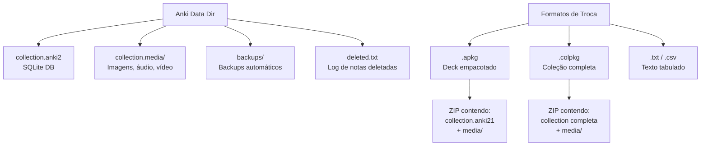
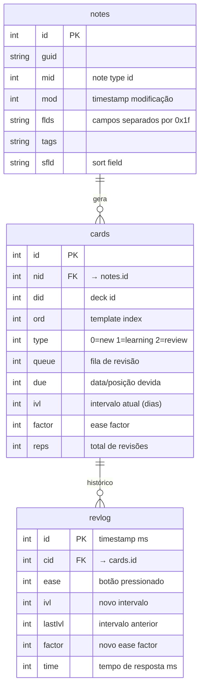
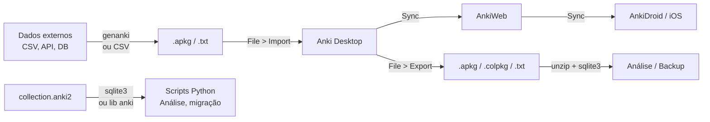

# Guia de Manipulação de Arquivos Anki

> [!tip] Este guia resume como usar, manipular e automatizar arquivos Anki programaticamente.

## Arquitetura de Arquivos



## Localização dos Dados

| OS | Caminho |
|----|---------|
| **macOS** | `~/Library/Application Support/Anki2/` |
| **Linux** | `~/.local/share/Anki2/` |
| **Windows** | `%APPDATA%\Anki2\` |

Dentro da pasta do perfil (ex: `User 1/`):
- `collection.anki2` — banco SQLite com notas, cards, decks, scheduling
- `collection.media/` — todos os arquivos de mídia (sem subpastas)
- `backups/` — backups automáticos (.colpkg)

> [!danger] Nunca modifique `collection.anki2` enquanto o Anki estiver aberto!

## Formatos de Arquivo

### 1. `.apkg` — Deck Empacotado

- É um **ZIP** contendo um banco SQLite (`collection.anki21`) + pasta `media`
- Usado para compartilhar decks ou transferir entre dispositivos
- Na importação, **mescla** com a coleção existente (não substitui)
- Notas duplicadas são atualizadas pela data de modificação mais recente

```bash
# Descompactar para inspecionar
unzip deck.apkg -d deck_contents/
# Resultado: collection.anki21 (SQLite) + media files numerados + media JSON map
```

### 2. `.colpkg` — Coleção Completa

- Também é um **ZIP** com SQLite + mídia
- Na importação, **substitui toda a coleção** (cuidado!)
- Usado para backup/restore completo

### 3. `.txt` / `.csv` — Texto Tabulado

- Campos separados por tab, vírgula, ponto-e-vírgula ou pipe
- Deve ser **UTF-8**
- Suporta HTML nos campos (com flag `#html:true`)
- Mídia referenciada como `` ou `[sound:file.mp3]`

Headers suportados (Anki 2.1.54+):
```
#separator:Tab
#html:true
#notetype:Basic
#deck:MeuDeck
#tags:tag1 tag2
campo1	campo2	campo3
```

### 4. `collection.anki2` — Banco SQLite

Schema principal:



## Manipulação Programática

### Python com `anki` (biblioteca oficial)

```bash
pip install anki
```

```python
from anki.collection import Collection

# Abrir coleção (Anki DEVE estar fechado)
col = Collection("/path/to/collection.anki2")

# Listar decks
for deck in col.decks.all():
    print(deck['name'], deck['id'])

# Listar notas
for nid in col.find_notes(""):
    note = col.get_note(nid)
    print(note.fields)

# Buscar notas com filtro
nids = col.find_notes("deck:MeuDeck tag:importante")

# Fechar (obrigatório!)
col.close()
```

### Python com `genanki` (criar .apkg)

```bash
pip install genanki
```

```python
import genanki

# Definir note type
model = genanki.Model(
    1607392319,  # ID único
    'Meu Modelo',
    fields=[
        {'name': 'Frente'},
        {'name': 'Verso'},
    ],
    templates=[{
        'name': 'Card 1',
        'qfmt': '{{Frente}}',
        'afmt': '{{FrontSide}}<hr>{{Verso}}',
    }]
)

# Criar deck
deck = genanki.Deck(2059400110, 'Meu Deck Gerado')

# Adicionar notas
deck.add_note(genanki.Note(
    model=model,
    fields=['Pergunta aqui', 'Resposta aqui']
))

# Exportar .apkg
genanki.Package(deck).write_to_file('output.apkg')
```

### SQLite direto (leitura/análise)

```bash
# Abrir banco
sqlite3 collection.anki2

# Ver schema
.tables
.schema notes
.schema cards

# Contar cards por estado
SELECT type, COUNT(*) FROM cards GROUP BY type;
-- type: 0=new, 1=learning, 2=review, 3=relearning

# Listar notas com campos
SELECT id, sfld, flds FROM notes LIMIT 10;

# Cards com maior intervalo
SELECT c.id, n.sfld, c.ivl
FROM cards c JOIN notes n ON c.nid = n.id
ORDER BY c.ivl DESC LIMIT 20;

# Histórico de revisões
SELECT date(id/1000, 'unixepoch') as dia, COUNT(*) as revisoes
FROM revlog GROUP BY dia ORDER BY dia DESC LIMIT 30;

# Exportar dump para recuperação
.dump > backup_dump.sql
```

### Importação via CSV automatizada

```python
# Gerar CSV compatível com Anki
import csv

cards = [
    ("What is SRS?", "Spaced Repetition System"),
    ("What is Anki?", "Open-source flashcard app using SRS"),
]

with open('import.txt', 'w', encoding='utf-8') as f:
    f.write('#separator:Tab\n')
    f.write('#notetype:Basic\n')
    f.write('#deck:AutoImport\n')
    f.write('#html:false\n')
    writer = csv.writer(f, delimiter='\t')
    for front, back in cards:
        writer.writerow([front, back])

# Importar no Anki: File > Import > selecionar import.txt
```

### Descompactar e inspecionar .apkg

```python
import zipfile, json, sqlite3

with zipfile.ZipFile('deck.apkg', 'r') as z:
    z.extractall('apkg_extracted/')

# Mapear arquivos de mídia
with open('apkg_extracted/media', 'r') as f:
    media_map = json.load(f)
    # {"0": "image.jpg", "1": "audio.mp3", ...}

# Inspecionar SQLite
conn = sqlite3.connect('apkg_extracted/collection.anki21')
cursor = conn.cursor()

# Ver notas
cursor.execute("SELECT sfld, flds FROM notes LIMIT 5")
for row in cursor.fetchall():
    print(row)

conn.close()
```

## Fluxos Comuns



## Flashcards — Conceitos-Chave

| Pergunta | Resposta |
|----------|----------|
| Qual o formato do banco Anki? | SQLite (`collection.anki2`) |
| O que é um `.apkg`? | ZIP com SQLite + mídia — mescla na importação |
| O que é um `.colpkg`? | ZIP com coleção completa — substitui tudo na importação |
| Como campos são separados no DB? | Caractere `0x1f` (unit separator) |
| Qual lib Python para criar .apkg? | `genanki` |
| Qual lib para abrir coleções? | `anki` (oficial) via `Collection()` |
| Encoding obrigatório para CSV? | UTF-8 |
| Onde fica mídia no Anki? | `collection.media/` (sem subpastas) |
| O que é `sfld`? | Sort field — primeiro campo, usado para ordenação e dedup |
| O que `type` significa em cards? | 0=new, 1=learning, 2=review, 3=relearning |
