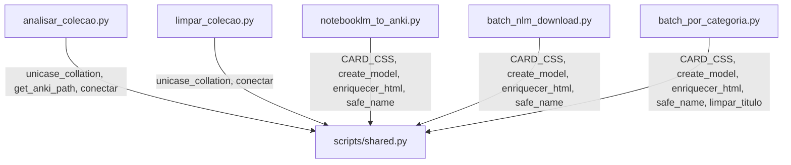

# shared.py — Modulo compartilhado

## O que e

Modulo Python que centraliza codigo duplicado entre os scripts do projeto Anki. Antes da refatoracao, funcoes como `unicase_collation()`, `conectar()`, `enriquecer_html()`, `CARD_CSS` e `safe_name()` estavam copiadas em 2-5 scripts diferentes.

## Funcoes e constantes exportadas

| Nome | Tipo | Usado por |
|------|------|-----------|
| `CARD_CSS` | Constante | notebooklm_to_anki, batch_nlm_download, batch_por_categoria |
| `create_model()` | Funcao | notebooklm_to_anki, batch_nlm_download, batch_por_categoria |
| `unicase_collation()` | Funcao | analisar_colecao, limpar_colecao |
| `get_anki_path()` | Funcao | analisar_colecao, limpar_colecao (via conectar) |
| `conectar()` | Funcao | analisar_colecao, limpar_colecao |
| `enriquecer_html()` | Funcao | notebooklm_to_anki, batch_nlm_download, batch_por_categoria |
| `safe_name()` | Funcao | notebooklm_to_anki, batch_nlm_download, batch_por_categoria |
| `limpar_titulo()` | Funcao | batch_por_categoria |

## Arquitetura



## Como testar

```bash
# Importar o modulo
python3 -c "import scripts.shared"

# Testar cada script
python3 scripts/analisar_colecao.py --perfil Data 2>&1 | head -5
python3 scripts/limpar_colecao.py --dry-run 2>&1 | head -5
python3 scripts/notebooklm_to_anki.py 2>&1 | head -3
python3 scripts/batch_por_categoria.py 2>&1 | head -5
```

> [!tip] Todos os comandos acima foram executados e verificados em 2026-03-18.

## Flashcards

**P: Por que o Anki precisa de uma collation "unicase" registrada manualmente?**
R: O Anki registra uma collation customizada no SQLite para ordenacao case-insensitive. Quando abrimos o banco fora do Anki, o SQLite do Python nao conhece essa collation e falha em queries com ORDER BY. Registrar `unicase_collation` resolve.

**P: Por que `create_model()` e uma funcao e nao uma constante global?**
R: O `genanki.Model` e mutavel e rastreia notas internamente. Se fosse uma constante compartilhada, multiplos scripts importando o mesmo objeto poderiam causar conflitos. Criar instancia nova a cada chamada evita isso.

**P: Por que o ID do Model (1607392077) e fixo e igual em todos os scripts?**
R: Para que todos os scripts gerem cards do mesmo note type no Anki. Se cada script usasse um ID diferente, o Anki criaria modelos separados e atualizar o CSS exigiria editar cada modelo individualmente.
